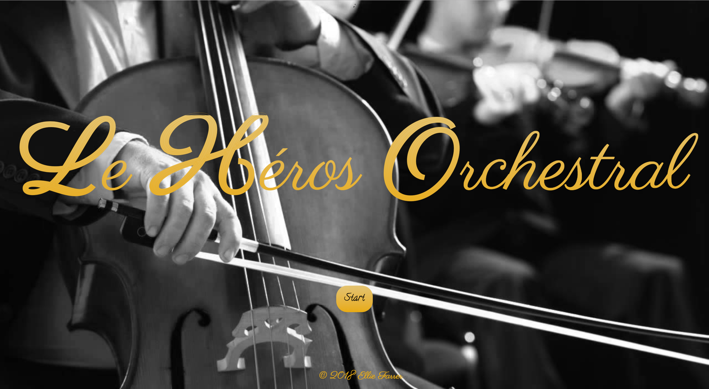
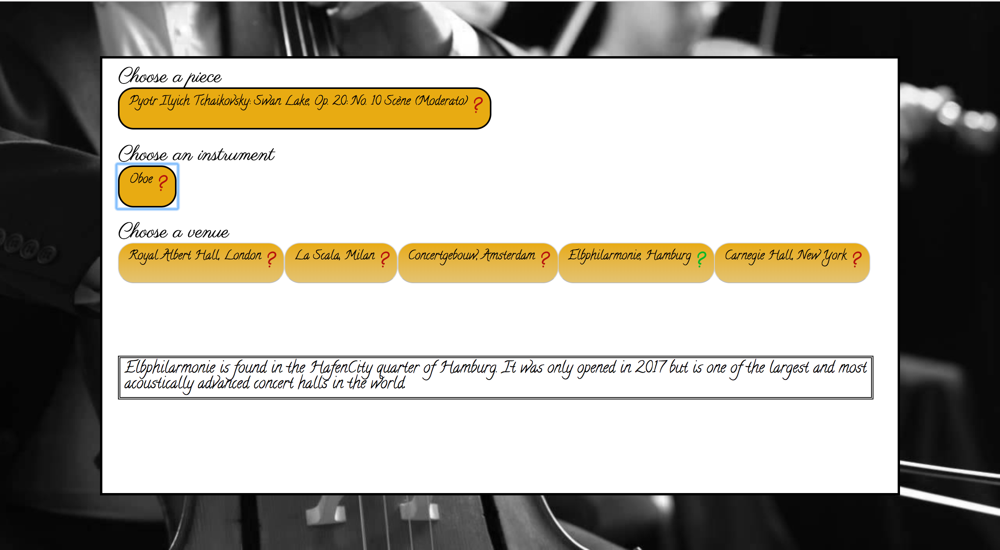
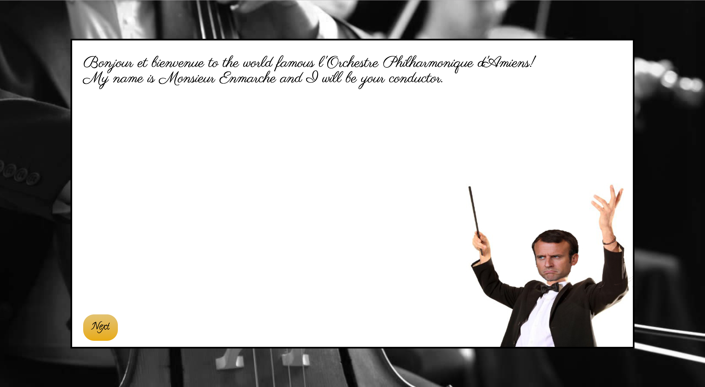
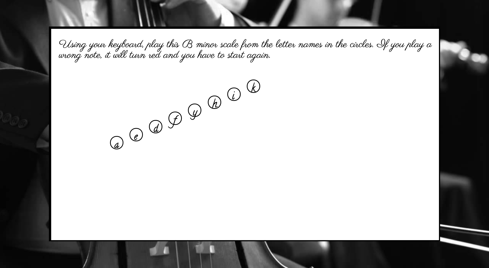
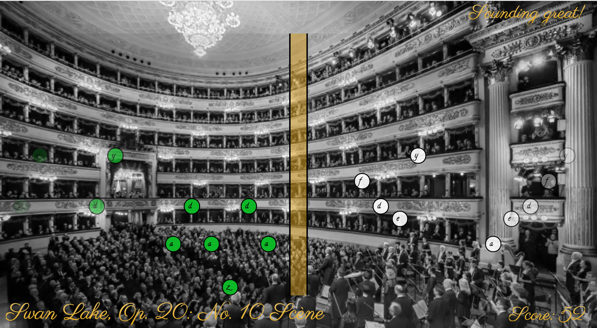
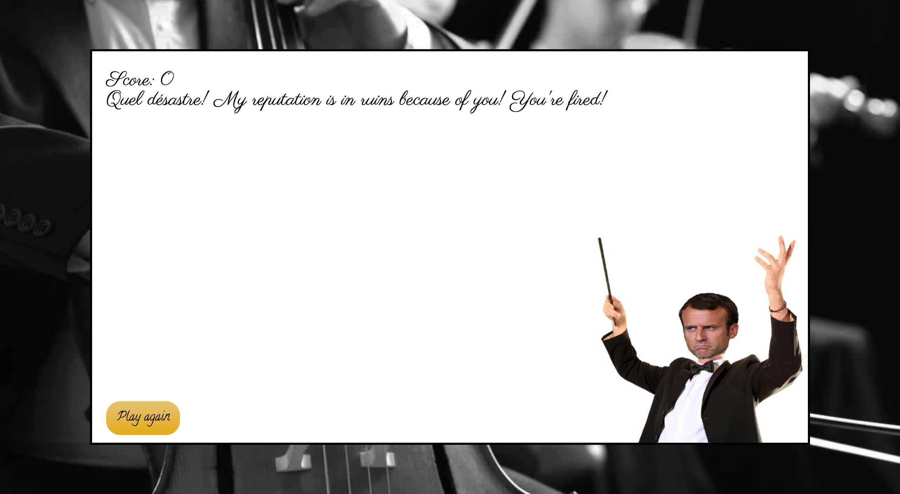
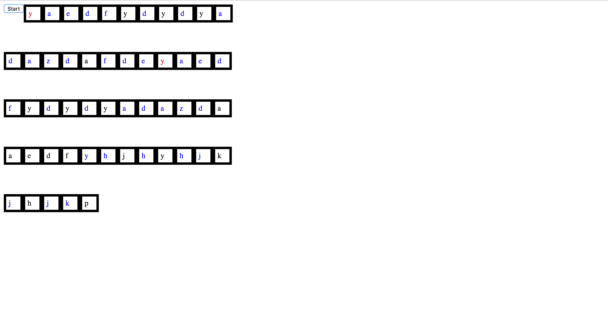
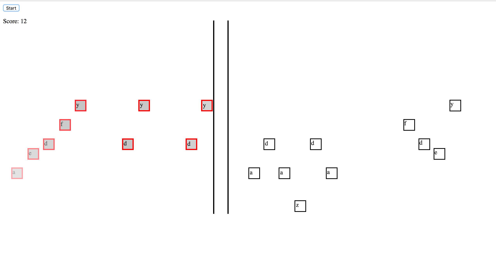

# General Assembly WDI Project 1: Le Héros Orchestral

[GitHub Pages](https://platypotomus.github.io/wdi-project1-orchestra-hero/)

[GitHub Repo](https://github.com/platypotomus/wdi-project1-orchestra-hero)

Le Héros Orchestral is a browser-based classical music game that promises to be both fun and educational. Play some fo the most famous classical music masterpieces in the world's finest concert halls with the world-renowned Orchestre Philharmonique d'Amiens! Just make sure you meet their strict standards and do not enrage their notoriously fierce conductor, M. Enmarche...

Le Héros Orchestral is my first project from General Assembly's Web Development Immersive. It was an individual project built in just over a week, and was both the first proper game I had built, and my first real go with JavaScript.

### Title


### Setup


### Introduction


### Audition


### Gameplay


### Result


---
## Brief
To create a single-page web game, using HTML, CSS, and JavaScript technologies learnt in the first three weeks of WDI.

## Technologies Used
* HTML5 with HTML5 audio
* CSS3 with animation
* JavaScript (ECMAScript 6)
* jQuery
* Git
* GitHub
* Google Fonts
* PhotoShop
* Logic Pro with EastWest samples (for the audio)


## Approach Taken

### Audio
*Scène no. 9* from Tchaikovsky's *Swan Lake* is the perfect choice for this game, not only because it is so beautiful and well known, but also because it sticks to the same tempo and metre throughout, and doesn't feature complex rhythms. So it was easy to divide up and code.

To replicate the oboe notes assigned to the keypresses, the orchestral backing, oboe squeaks, and the crotale notes for the buttons, I used Logic Pro with EastWest Samples. I do not own the tuning up or booing audio.

### Functionality

#### Keypresses
I worked on the keypresses first, by laying out the fifteen keys in the style of a piano keyboard, but with the lowest note and highest note elsewhere. Each keypress command is shown in a div, which is created two bars before the user is due to play it. Because of setInterval's propensity to lag - which would have spelt disaster by being no where near in time with the backing - I had to assign each note a setTimeout.

#### Divs Created on Cue


Next, I used CSS animation to move the divs along the screen. As an experienced musician, it seemed more intuitive, from a UX point of view, to move the divs from right to left and have them collide in the centre of the screen. This made collision detection much more difficult. When their animation stops, they're removed from the DOM.

### Featured Piece of Code no. 1
This gets the dimensions of the relative elements to check for collision. In order to check the right note, I get the first div with a class of animate, that has a class of the key the user just played, and that doesn't have a class of dead or miss. From js/app.js
```
const barLeft = $bar.offset().left;
const barRight = Number($bar.offset().left) + Number($bar.width());

const letter = String.fromCharCode(e.which);
const query = '.animate.' + letter.toLowerCase() + ':not(.dead)' + ':not(.miss)';
const $notesToCheck = $(query);
$notesToCheck.first().each((i, el) => {
  const noteLeft = $(el).offset().left;
  const noteRight = Number($(el).offset().left) + Number($(el).width());
```

#### Gameplay when I'd Hit MVP


Next, I made the scoring and gameplay more interesting by adding surprise bonuses for hit streaks and penalties for miss streaks. Then I added extra features such as the introduction pages, including an "audition" page to get the player accustomed to the keypresses. Then I added the feature allowing the user to select the gameplay background by selecting the venue.

### Styling
I initially envisaged a classy gold and brown design for the game, but later switched to black, white, and gold. I used two Google Fonts: Parisienne for the titles, and Calligraffitti for the rest of the text.

PhotoShop was used for a number of the graphics, including to create Monsieur Enmarche, who is half stock image conductor, Emmanuel Macron.

### Featured Piece of Code no. 2
This piece of CSS gives the title text a subtle gradient, as well as a subtle stroke outline which also runs in the middle of the font to create a subtle, wood-like effect. From css/style.css
```
h1 {
  font-family: 'Parisienne', cursive;
  background: -webkit-linear-gradient(#E3C372, #E9AB11);
  -webkit-background-clip: text;
  -webkit-text-fill-color: transparent;
  -webkit-text-stroke: .2px #E9AB11;
  color: #E3C372;
}
```


## Wins and Blockers
A huge win was building the game itself, and really pushing the limits of what I had learnt so far, especially with more complex CSS3 and jQuery. I am also very happy with the styling and the UX, as well as how I dealt with the tempo issues.

By far the biggest blocker was collision detection. Because I had to check for collisions in the middle of the screen, I had to consider what the divs were doing after this, so I couldn't just remove them from the DOM. So it was a blocker to check for the right div to the right time, as well as to deal with notes that had been missed completely.


## Future Features
Along with adding in more pieces and instruments, there are a number of future features I would like to add, including:
* A second, larger, and invisible collision zone so notes aren't given a class of "miss" if they're played at least one bar early.
* Making the main (visible) collision area widen if the player is not doing well, and narrow if they are.
* Authentication so users can create an account and keep track of their score over time.
* A "concert" or "tour" feature, allowing users to play more pieces in a shorter length of time. Tour would include venue changes.
* Two player mode, so two users can duet on different computers.
